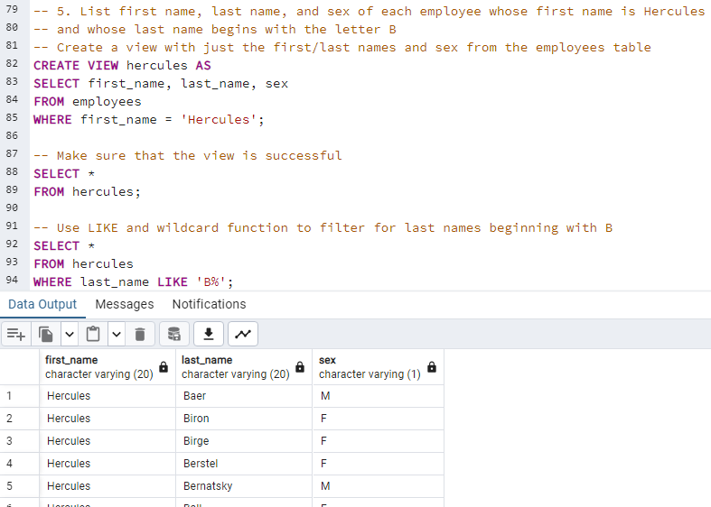

# sql-challenge

## Objective
The objective of this challenge was to use the module 9 skills to build an Entity Relationship Diagram (ERD) and load tables into pgAdmin to query using SQL.

## Data Modeling
* The ERD was created using QuickDBD and exported to the challenge folder. Figures 1 and 2 show the inputs and resulting diagram from QuickDBD. Further explanation of keys in the next section.

Figures 1 and 2 of the ERD

---------------------------------
## Data Engineering (70 points)
* I created the ERD in QuickDBD (as stated above). After checking the CSV files, most columns were assigned as varchar data types, with only a few being assigned date or int.
* While looking through the CSV files, I made note of columns that had unique, non-repeating values and assigned them as the primary keys for each table.
* The one exception to each table having one primary key was the 'dept_emp' table, where each column had repeating values. To overcome this, I made both columns the primary key, i.e. a composite key (tutoring session).
* Once I assigned the primary keys, I linked the tables together as best I could, refer back to figure 2.
* After completing the ERD in QuickDBD, I exported the schema to a .sql file and imported it into a new database query in pgAdmin 4.
* I did get an error when putting the schema into pgAdmin, and I needed to add a unique key to the emp_no column by using code from Xpert Learning Assistant:
    * `ALTER TABLE "salaries" ADD CONSTRAINT "unique_emp_no" UNIQUE ("emp_no");`
* After the schema was correctly in place, I imported the CSVs into the schema. The CSVs were not imported in the same order as the table creation/the ERD schema. I'm not sure why this was the case, but I had to import the CSVs in this order:
    * departments
    * salaries
    * dept_emp
    * titles
    * employees
    * dept_manager

---------------------------------
## Data Analysis
The following list contains the requirement for the assignment, with brief statemennts on how the result was accomplished and related image for posterity.
1. List the employee number, last name, first name, sex, and salary of each employee: I joined the 'employees' and 'salaries' tables on 'emp_no'. See figure 3.

Fig 3: employee demographics and salaries.

2. List the first name, last name, and hire date for the employees who were hired in 1986: I created a temporary view named 'emp_1986' where I pulled the 'first_name', 'last_name', and 'hire_date' from the 'employees' table. Within this query I specified that the year should be extracted from 'hire_date' and be equal to 1986 (help from Xpert Learning Assistant). Then I used `SELECT * FROM emp_1986` to produce the list of employees hired in 1986. See figure 4.

Fig 4: employees hired in 1986.

3. List the manager of each department along with their department number, department name, employee number, last name, and first name: to get this list, I used aliases and joins to join tables 'dept_manager', 'departments', and 'employees'. See figure 5.

Fig 5: department managers.

4. List the department number for each employee along with that employee’s employee number, last name, first name, and department name: I used aliases and joins to combine tables 'departments', 'dept_emp', and 'employees'. See figure 6.

Fig 6: department employees.

5. List first name, last name, and sex of each employee whose first name is Hercules and whose last name begins with the letter B: I created temporary view 'hercules' by pulling the 'first_name', 'last_name', and 'sex' from the 'employees' table, and filtered the first names to 'Hercules'. In order to get a list of employees with the first name Hercules and last names beginning with B, I used 'LIKE' and the wildcard feature '%' that finds any number of values within a specified query. The resulting code for this was `SELECT * FROM employees WHERE last_name LIKE 'B%'`. See figure 7.

Fig 7: employees with first name Hercules and last name beginning with B.

6. List each employee in the Sales department, including their employee number, last name, and first name: I created a temporary view called 'dept_emps' and used the 'AS' keyword to select the desired columns, tables, and joins that would provide the needed information. Then I displayed the view and used `WHERE dept_name = 'Sales'` to show only employees in the Sales department. See figure 8.

Fig 8: sales department employees.

7. List each employee in the Sales and Development departments, including their employee number, last name, first name, and department name: I kept the 'dept_emps' view and `WHERE dept_name = 'Sales'` code like in 6, but added `OR dept_name = 'Development'` to the 'WHERE' statement to get the list of employees in either Sales or Development. See figure 9.

Fig 9: sales and development departments employees.

8. List the frequency counts, in descending order, of all the employee last names (that is, how many employees share each last name): using Xpert Learning Assistant after a few failed attempts, I was able to use only the 'employees' table and select the 'last_name' column, apply a 'COUNT()' function, and then group the results by the 'last_name' count, in descending order of frequency. See figure 10.

Fig 10: frequency of last names of employees.

---------------------------------
## Resources
* Module 9 activities
* ask-your-class channel on Slack
* Xpert Learning Assistant
* Tutoring session with K. Bailey
